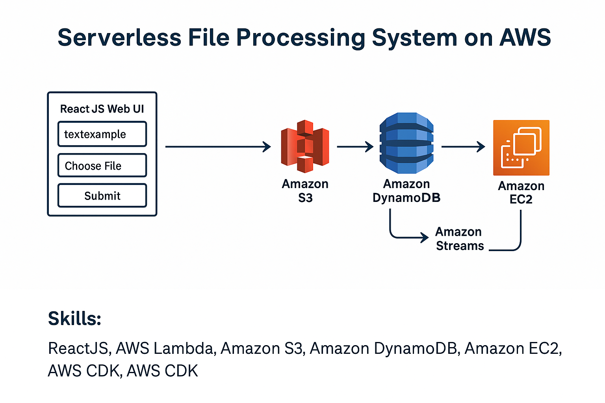

# Project Title: Serverless File Processing System on AWS
<p align="center">
  
</p>
## Overview
This project implements a serverless file processing system using AWS services. It features a responsive web UI built with ReactJS that allows users to input text and upload a file. The file is uploaded directly to S3, and the input details are saved in a DynamoDB table. When a new item is added to the DynamoDB table, a VM instance (EC2) is automatically triggered to process the file. Once the file is processed, the output is uploaded back to S3, and the DynamoDB table is updated with the output details before the VM is terminated.

## System Components
- **ReactJS Web UI**
- **Amazon S3**
- **Amazon DynamoDB** 
- **Amazon EC2** 
- **AWS Lambda** 
- **API Gateway**
- **Amazon DynamoDB Streams**
- **AWS CDK**

## Functionality
1. **Upload**: The user inputs text and chooses a file to upload. The file is uploaded to S3, and the input details are stored in DynamoDB.
2. **Process**: A VM is spun up to process the file. It retrieves the input file and text from S3 and DynamoDB, respectively.
3. **Save Output**: After processing, the output file is saved to S3, and its details are logged in DynamoDB.
4. **Cleanup**: The VM is terminated after the process is complete to ensure cost-efficiency.

## How to Use
1. **Start the Web UI**: Open the web interface provided by the ReactJS application.
2. **Enter Text**: Type in the text input box.
3. **Upload File**: Choose and upload the file you wish to process.
4. **Submit**: Click the 'Submit' button to start the upload and processing sequence.

## Prerequisites
- AWS Account
- Configured AWS CLI
- Node.js and npm installed
- ReactJS knowledge for UI modifications

## Installation & Setup
1. Clone the repository to your local machine.
2. Navigate to the project directory and install the necessary npm packages:
   ```sh
   npm install
   ```
3. Start the React development server:
   ```sh
   npm start
   ```
4. Deploy the backend resources using AWS CDK:
   ```sh
   cdk deploy
   ```

## AWS Setup
- Ensure you have the necessary IAM roles and policies configured for S3, DynamoDB, EC2, and Lambda.
- Set up an API Gateway to trigger Lambda functions.
- Use AWS CDK scripts located in the `infra` directory to set up your infrastructure.

## Local Development
- For local development, you can use the AWS SAM CLI to invoke Lambda functions locally and simulate API Gateway locally.

## Deployment
- Use the AWS CDK to deploy your infrastructure and GitHub Actions or other CI/CD pipelines to automate deployment of your React application.
